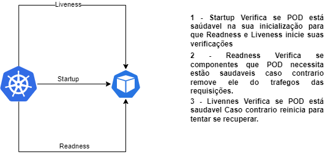

# POC Aplicabilidade de probes para garantir a saúde do POD gerenciado pelo K8S utilizando Spring Boot Actuator e o conceito de Liveness, Readiness e Startup

 

## Fluxo de da aplicação

## Fundamentos teóricos

> Probes são mecanismos utilizados em ambientes de computação em nuvem e orquestradores de contêineres, como o Kubernetes, para verificar a disponibilidade e a prontidão dos aplicativos. Existem três tipos principais de probes: liveness, readiness e startup.

> A probe de liveness (vivacidade) é responsável por verificar se um aplicativo está em execução e saudável. Ela é usada para detectar falhas e reiniciar o aplicativo caso ele pare de responder corretamente. A liveness probe envia solicitações periódicas para o aplicativo e verifica se recebe respostas adequadas. Se o aplicativo não responder ou retornar erros, o orquestrador pode reiniciar o contêiner que hospeda o aplicativo.

> A probe de readiness (prontidão) é utilizada para determinar se um aplicativo está pronto para receber tráfego de entrada. Ela é usada para evitar que um aplicativo seja direcionado para tráfego enquanto ainda estiver inicializando ou estiver em um estado inconsistente. A readiness probe verifica se o aplicativo está pronto para lidar com solicitações. Se o aplicativo não estiver pronto, o orquestrador de contêineres pode remover o aplicativo dos balanceadores de carga ou das rotas de tráfego.

> A probe de startup é específica para o momento em que um contêiner é iniciado. Ela verifica se o aplicativo dentro do contêiner foi inicializado com sucesso e está pronto para ser executado. A probe de startup é usada durante o processo de inicialização do contêiner e pode ser útil para atrasar a disponibilidade do aplicativo até que ele tenha concluído certas tarefas de inicialização, como carregar dados ou configurar conexões com bancos de dados.

> Essas probes são essenciais para garantir a confiabilidade e a disponibilidade de aplicativos em ambientes de orquestração de contêineres. Elas permitem que o orquestrador monitore e tome ações automáticas com base no estado de saúde e prontidão dos aplicativos, contribuindo para a estabilidade do sistema e a experiência do usuário.

## Setup
- Database 
  - kubectl apply -f k8s/db/configmap.yaml
  - kubectl apply -f k8s/db/secret.yaml
  - kubectl apply -f k8s/db/persistentVolume.yaml
  - kubectl apply -f k8s/db/persistentVolumeClaim.yaml
  - kubectl apply -f k8s/db/deployment.yaml
  - kubectl apply -f k8s/db/service.yaml
- Message
  - Zoookeeper
    - kubectl apply -f k8s/message/zookeeper/deployment.yaml
    - kubectl apply -f k8s/message/zookeeper/service.yaml
  - Kafka
    - kubectl apply -f k8s/message/kafka/deployment.yaml
    - kubectl apply -f k8s/message/kafka/service.yaml
  - APP
    - kubectl apply -f k8s/app/configmap.yaml
    - kubectl apply -f k8s/app/secret.yaml
    - kubectl apply -f k8s/app/deployment.yaml
    - kubectl apply -f k8s/app/service.yaml